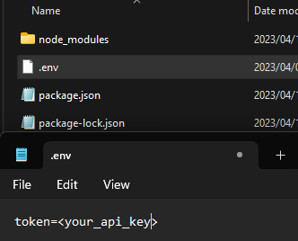

# GPT-Terminal

> Basic program in Javascript (Node.js) that allows the usage of OpenAI's API through the terminal.


## Install

Ensure you have [Node.js](https://nodejs.org) version 16.x + installed. Then run the following:

```sh
npm i -g gpt-terminal
```
Or

```sh
npm install --global gpt-terminal
```

<br />
Once you installed the npm package, you need to setup your API key.<br /><br />
Create a `.env` file that contains `token=<api_key>` where you downloaded this module.<br />
`<api_key>` will be replaced with your [ChatGPT API Key](https://platform.openai.com/account/api-keys).




## Usage

Just write this extremely difficult command in your terminal:
```
gpt
```

Once you're done with that, a new pop-ul will appear on screen:


Just type your question for [ChatGPT](https://chat.openai.com/chat).<br />
If you want to give a file as an input just type `read <your_file_name>` like this:


> *PS: Quotes " " are optional.*

## Important!

Be aware that any newline ('\n') sent as input directly from the terminal will be recognized as an 'Enter' resulting in sending the query to ChatGPT. If you want to use text blocks as input, I recommend putting them in a file and doing the step above.